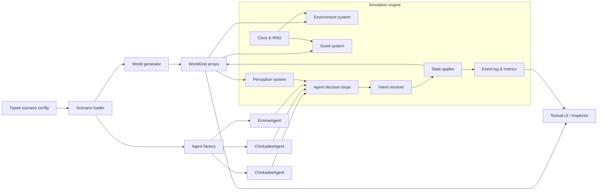
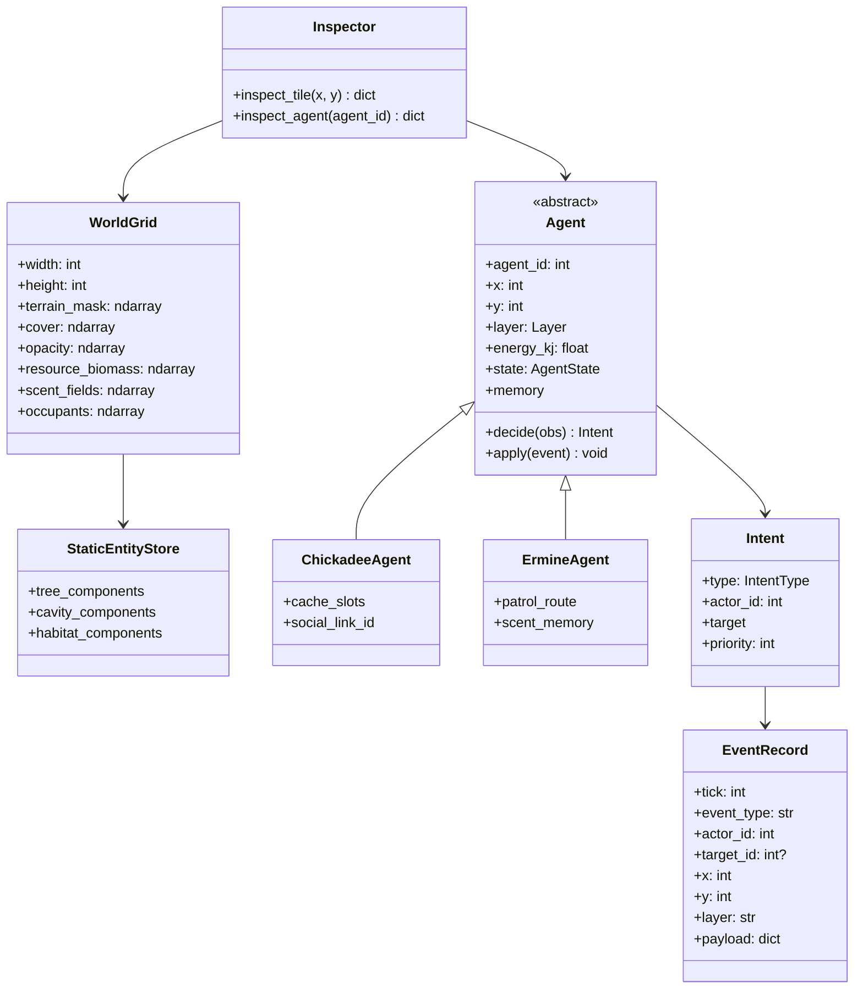
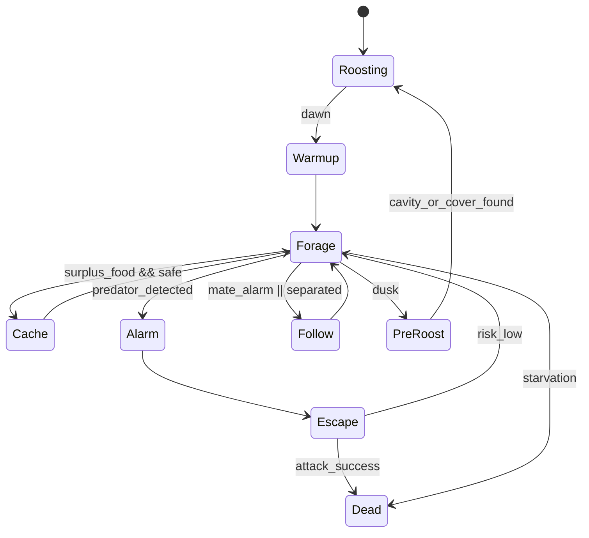
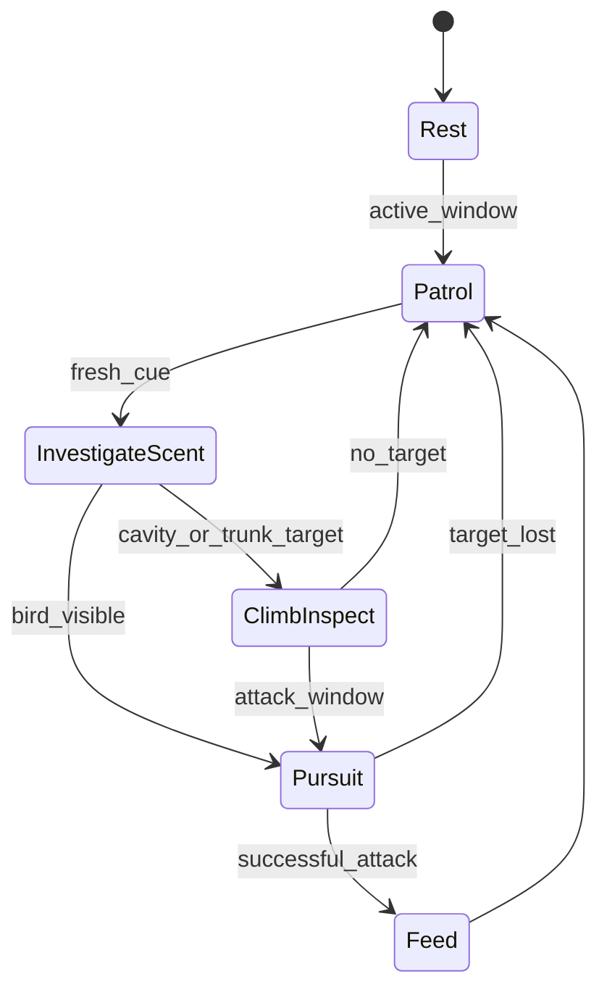

# Vertical Slice MVP for a Boreal Chickadee and Ermine Micro-Forest

> Note: this document was transferred from a research/planning conversation. Inline `turn...` citation references are retained as research trace markers, but they should eventually be replaced with a proper bibliography or source links.

## Executive summary

The tightest implementable vertical slice is a **single focal boreal stand** on a **50×50 grid** with **five vertical layers**—ground, understory, trunk, canopy, cavity—containing **two boreal chickadees**, **one ermine**, **black spruce with occasional snag/cavity states**, **insect resource pools**, and simple **moss/fungi habitat modifiers**. The slice should simulate **one late-winter or early-spring day-night cycle** with deterministic stepping, agent inspection, event logging, and a minimal playable UI. The core loop is: chickadees forage in conifer crowns and bark, maintain energy, prefer remembered profitable sites and cavities at dusk, and react to predator presence; the ermine patrols ground and trunk routes, follows scent, inspects cavities, and opportunistically attacks birds when exposure is favorable. This scope fits the species’ natural history better than a flat map, because boreal chickadees are tightly associated with mature conifers, forage mostly in the middle and upper parts of trees, cache food, and use cavities or protected roost sites, while ermine are ground-and-crevice hunters with strong olfactory behavior and regular use of holes, logs, roots, and dense cover. [research refs: turn25view1, turn25view2, turn6search3, turn6search14, turn16view0, turn42view0]

The most pragmatic Python-first stack is: **Python 3.12**, **uv** for project and dependency management, **NumPy** for world arrays, **standard-library dataclasses** for internal objects, **msgspec** for typed config and fast snapshot/event serialization, **Textual** for the first inspect-first playable UI, **pytest** and **Hypothesis** for testing, and **Ruff** plus **mypy** for code quality. This keeps the runtime small, avoids premature engine complexity, and still gives fast structured I/O, typed data, and a usable debugger UI. **Numba** should be optional and introduced only after profiling, primarily for scent diffusion or visibility kernels if needed. [research refs: turn31search0, turn31search5, turn31search3, turn31search15, turn33search0, turn32search0, turn32search1, turn32search2, turn32search3, turn36search2]

Biologically, the map should be treated as a **repeatedly visited focal patch**, not a whole home range. Boreal chickadee winter flocks in Alaska use roughly **40 acres** of winter feeding range, and ermine home ranges are much larger than a 50×50 micro-map in both subarctic and temperate studies. That makes a local “micro-forest slice” the correct abstraction: the simulation represents the part of a larger territory that contains favored trees, cavities, and predator travel routes. Because male ermine typically range more widely than females, the default predator should be an **adult female ermine**, which makes a local patch-based interaction more plausible. [research refs: turn25view1, turn25view2, turn18view1, turn18view2, turn42view0]

The biggest scoping decision is what **not** to model. This MVP should explicitly omit full breeding, explicit rodent agents, snow physics, weather fronts, inheritance/genetics, flock hierarchies beyond alarm/follow behavior, and photoreal rendering. Ermine energetics are only partly grounded by the sources used here: a species-specific basal metabolic value is available, but not a directly matching boreal field-energy budget, so the active daily drain below is a transparent design assumption. Likewise, direct boreal chickadee winter energetics are thinner than related chickadee literature, so the energy defaults use avian field-metabolic scaling and mountain chickadee winter-roosting/energetics as close parid proxies. [research refs: turn24view0, turn39view0, turn12search1, turn12search3, turn13search0]

## Ecological scope and defaults

The recommended scenario is a **late-winter focal stand**. That choice preserves the most important chickadee traits for a minimal slice—high cold-season energetic pressure, food-site memory, cavity use, and daily movement through vertical tree structure—while keeping insect resources implementable as bark/needle/ground micro-pools rather than full arthropod populations. It also suits ermine behavior, because the predator naturally investigates holes, roots, crevices, and tree bases, and birds are most vulnerable when roosting or descending into lower cover. [research refs: turn25view1, turn25view2, turn16view0, turn42view0, turn29view0]

### Recommended defaults for unspecified choices

| Open choice | Recommended default | Why this is the tightest MVP |
|---|---|---|
| Season | Late winter / pre-breeding day-night slice | Supports energy tension, cavity use, memory, and predator threat without chicks or nestlings |
| Visualization target | Desktop terminal UI first | Textual gives an inspectable, low-cost playable interface before sprite rendering [research ref: turn36search2] |
| Map size | 50×50 tiles | Matches user preference; still large enough for route choice and vertical structure |
| Tile scale | 2 m per tile | Produces a 100×100 m focal patch; intentionally smaller than full chickadee or ermine ranges |
| Default tree species | Black spruce with live/dead state | Boreal chickadees strongly favor spruce, especially black spruce, and dense crown use is supported by field work [research refs: turn6search3, turn6search9, turn6search21] |
| Predator sex | Adult female ermine | Smaller, more local home ranges than males make a focal-patch simulation less distorted [research refs: turn18view1, turn18view2, turn42view0] |
| Time step | 10 s/tick | Fine enough for predator-prey tension and inspectability, coarse enough for performance |
| Simulation length | 1 day default, 3 days optional batch mode | Enough to demonstrate foraging, threat response, and roosting |

A 100×100 m focal patch is intentionally much smaller than real winter use areas. Boreal chickadees in Alaska use about 40 acres in winter, and ermine can travel long distances nightly and occupy 10–20 ha or more depending on prey and region, so the game world should be described to players and developers as a **microhabitat slice** rather than a territory simulator. [research refs: turn25view1, turn25view2, turn42view0, turn18view1]

### Species and resource profile

| Entity | MVP representation | Key parameters for implementation | Evidence and assumptions |
|---|---|---|---|
| Boreal chickadee | Two agent objects with individual energy, memory, location, and state machine | Mass default **10 g**; preferred foraging on **trunk + canopy of spruce**, especially dense crown zones; winter focal energy target **~50–60 kJ/day**; nightly cavity bonus **~30% energy saving**; natural memory is “hundreds of hiding places,” but MVP memory should be **8 profitable sites + 6 cache slots** as an explicit abstraction | Boreal chickadees weigh about 10 g, forage in the middle and higher parts of conifer trees, probe bark crevices, store food, and remember hundreds of locations; the Alaska account reports daily fat gain capacity of about 8% body mass; mountain chickadee cavity roosting reduces nocturnal costs by roughly 25–38%; avian FMR scales as **10.5·Mb^0.681** for birds, which puts a 10 g bird near 50 kJ/day before a cold-weather adjustment. [research refs: turn25view0, turn25view1, turn25view2, turn6search3, turn6search14, turn39view0, turn13search0] |
| Ermine | One agent object with patrol memory, scent following, climb inspection, and pounce behavior | Default adult female mass **120 g**; BMR reference **1.276 W** from AnAge, which is about **110 kJ/day**; MVP active daily drain **140 kJ/day** as an explicit design assumption; scent is primary tracking cue; patrol waypoints **10**; max climb layer **trunk/cavity only** | Ermine are small, solitary, scent-marking carnivores with keen smell, vision, hearing, and touch; they hunt mainly small mammals but also eat birds, eggs, and insects when mammals are scarce, and daily meals are important; home ranges are much smaller in females than males. The 140 kJ/day active drain is a modeling default built on the cited basal value, not a directly measured field budget for this exact slice. [research refs: turn24view0, turn16view0, turn42view0, turn18view1, turn18view2, turn41search8, turn21search0] |
| Black spruce tree | Static ECS entity with trunk anchor and crown footprint | Crown footprint **3×3 tiles**; trunk anchor **1 tile**; cavity probability only on decayed/snags; bark insect bonus **high** | Boreal chickadees used only a few conifers in the Michigan overlap study and foraged heavily in black spruce, especially dense medial crown foliage near the top; spruce is also emphasized in Alaska and Cornell accounts. [research refs: turn6search3, turn6search9, turn25view1, turn5search12] |
| Snag / cavity tree | Tree entity with `state=dead` and cavity component | Cavity entrance on trunk layer; height abstracted into cavity access score; capacity **1 chickadee** | Boreal chickadees nest and roost in cavities, frequently in dead trees or stubs, with entrances reported from about 1 to 35 ft high; cavity roosting has major thermal value in related chickadees. [research refs: turn7search10, turn25view1, turn13search0] |
| Insect resource pools | Layered biomass fields tied to bark, canopy, ground, and decay sites | Pool units **float biomass**, regenerate slowly; preferred categories are bark insects, larvae, spiders, Diptera/Lepidoptera proxies | Adults glean insects, eggs, larvae, spiders, and seeds from bark, twigs, branches, and cones; nestling diet work found Boreal Chickadee prey dominated by Araneae, Diptera, and Lepidoptera. [research refs: turn25view1, turn25view2, turn14view1] |
| Moss patches | Static habitat modifier | +moisture, +ground cover, +insect regeneration, +scent persistence | Functional-group assumption for MVP; not modeled to species level |
| Fungi / decayed logs | Static habitat modifier | +decay insects, +ermine inspection interest, +cavity probability nearby | Functional-group assumption for MVP; not modeled to species level |

### Concise product spec

| Item | Spec |
|---|---|
| Player-facing experience | A top-down, inspectable micro-forest where the user can run, pause, single-step, switch overlays, and inspect any tile or agent |
| Primary fantasy | Watch a small boreal pair survive a conifer stand while a cryptic ground predator turns safe routes and cavities into risky choices |
| Win condition | Not a score game; a successful slice is a plausible 1-day run with foraging, at least one meaningful predator-threat interaction, and a dusk roost decision |
| Must-have simulation beats | Foraging, energy gain/loss, memory-biased site choice, scent and visibility, predator patrol and pursuit, cavity use, event replay |
| Must-not-have in MVP | Chicks, explicit rodent prey, snow depth physics, weather systems, genetics, multiplayer, procedural audio |

### MVP feature table

| Feature | Priority | Effort | Acceptance criteria |
|---|---|---:|---|
| Deterministic simulation core | P0 | M | Same seed produces identical event log and final state |
| 50×50 layered forest map | P0 | M | Map contains valid ground/understory/trunk/canopy/cavity data with no invalid occupancies |
| Boreal chickadee baseline AI | P0 | M | Chickadees maintain energy by foraging, prefer spruce crown/trunk zones, and roost before night |
| Ermine baseline AI | P0 | M | Ermine patrols ground/trunk, investigates scent, and can threaten or attack exposed birds |
| Insect pools and habitat modifiers | P0 | S | Trees, moss, fungi, and decay states affect prey availability measurably |
| Scent field and line-of-sight | P0 | M | Fresh ermine traces alter chickadee decision weights; occlusion affects spotting |
| Cavity system | P0 | S | Chickadees can occupy cavities; ermine can inspect and contest cavity sites |
| Inspection API | P0 | S | Any tile or agent can be queried for summary, layers, resources, scent, and recent events |
| Textual playable UI | P1 | M | User can step, pause, change overlays, and inspect tiles/entities without code |
| Save/load snapshots | P1 | S | A run can be saved mid-day and resumed with no divergence |
| Simplified caching | P1 | M | Chickadees can store and retrieve a small number of food parcels tied to memory |
| Batch plausibility harness | P1 | M | 100-seed runs export summary metrics and flag implausible distributions |

## Technical architecture

The right architecture is a **hybrid ECS for the world and static entities**, combined with **agent objects** for chickadees and the ermine. The world, trees, cavities, and resource layers are regular enough for array-backed ECS-style storage; the bird and predator are behaviorally richer and benefit from object-level memory, utility scoring, and state transitions. This is more implementable than a pure ECS for three animals, and more scalable than a pure OOP map where every tree tile becomes a heavyweight object. [research refs: turn31search0, turn31search5, turn31search3]

### Recommended Python stack

| Layer | Recommendation | Why |
|---|---|---|
| Runtime | Python 3.12 | Stable ecosystem baseline and modern standard library |
| Project management | uv | Fast project and package manager for repeatable local and CI workflows |
| World arrays | NumPy | Efficient fixed-shape multidimensional arrays for tiles, layers, scent, visibility, and resources |
| Internal domain objects | `dataclasses` | Lightweight typed classes with generated `__init__` and `__repr__` |
| Config + snapshots + fast typed I/O | msgspec | Typed decoding plus fast JSON/MessagePack/YAML/TOML support |
| Playable MVP UI | Textual | Inspect-first terminal UI with widgets and event handling |
| Charts and offline debug views | Matplotlib | Simple raster/grid debugging via `imshow` |
| Tests | pytest + Hypothesis | Conventional plus property-based testing |
| Code quality | Ruff + mypy | Fast linting/formatting and static typing |
| Optional speedup later | Numba | JIT only for profiled hot loops |

These recommendations are grounded in the official documentation: NumPy arrays are fixed-shape homogeneous multidimensional containers; `dataclasses` generate boilerplate methods for typed classes; msgspec provides fast typed serialization and validation across JSON, MessagePack, YAML, and TOML; uv manages Python projects and packages; Textual is designed for Python UIs in the terminal or browser; pytest, Hypothesis, Ruff, and mypy each cover complementary testing and correctness roles. [research refs: turn31search0, turn31search5, turn31search3, turn31search15, turn33search0, turn36search2, turn36search3, turn32search0, turn32search1, turn32search2, turn32search3]

### Architecture diagram



### Core classes and stores



### Message and event pattern

The simulation should be **staged and deterministic**, not fully reactive. Each tick runs in this order:

1. Environment update
2. Scent diffusion and decay
3. Perception build
4. Agent decision to immutable intents
5. Intent resolution and collision handling
6. Action application
7. Metabolism and state transitions
8. Event emission and logging

That pattern matters because the user asked for inspection and causal readability. A staged pipeline creates clear explanations like: “fresh ermine scent increased perceived risk, which lowered cavity desirability, which changed the chickadee’s goal from `PreRoost` to `EscapeToCanopy`.” The UI can then expose both the top-level summary and the underlying causal chain.

| Message type | Producer | Consumer | Purpose |
|---|---|---|---|
| `PerceptPacket` | Perception system | Agent | Visible tiles, heard alarms, nearby scent strengths, reachable actions |
| `Intent` | Agent | Resolver | Proposed movement, forage, cache, inspect cavity, pounce, roost |
| `WorldEvent` | Resolver / systems | Logger + Inspector | Immutable trace of what actually happened |
| `InspectQuery` | UI | Inspector | Human-readable debug request |
| `InspectBundle` | Inspector | UI | Summary + modules for display |

### Example main simulation loop

```python
from dataclasses import dataclass

@dataclass
class SimResult:
    ticks_run: int
    events_emitted: int
    terminated_reason: str

def run_sim(engine, world, agents, max_ticks: int) -> SimResult:
    """
    Deterministic simulation loop.
    Assumes engine contains clock, rng, systems, resolver, and logger.
    """
    total_events = 0

    for tick in range(max_ticks):
        engine.clock.advance()

        engine.environment_system.step(world, engine.clock)
        engine.scent_system.step(world)
        engine.resource_system.step(world, engine.clock)

        percepts = engine.perception_system.build(world, agents)

        intents = []
        for agent in agents:
            if agent.state == "dead":
                continue
            obs = percepts[agent.agent_id]
            intent = agent.decide(obs, world, engine.clock, engine.rng)
            intents.append(intent)

        resolved = engine.intent_resolver.resolve(intents, world, agents, engine.rng)
        events = engine.state_applier.apply(resolved, world, agents, engine.clock)

        engine.metabolism_system.step(world, agents, engine.clock, events)
        engine.logger.write(events)

        total_events += len(events)

        if engine.termination_policy.should_stop(world, agents, engine.clock):
            return SimResult(
                ticks_run=tick + 1,
                events_emitted=total_events,
                terminated_reason=engine.termination_policy.reason,
            )

    return SimResult(
        ticks_run=max_ticks,
        events_emitted=total_events,
        terminated_reason="max_ticks_reached",
    )
```

## World model and agent design

### Tile model and verticality

The tile grid should be a **2D horizontal raster with per-layer channels**, not separate 3D voxels. Each horizontal tile stores five possible ecological layers:

| Layer | What it represents | Typical occupants | Notes |
|---|---|---|---|
| Ground | Snow/soil/log surface, root base, litter | Ermine, transient bird, moss, fungi, insects | Main predator travel layer |
| Understory | Shrubs, saplings, low cover | Bird, insects | Primarily cover/occlusion, not ermine residence in MVP |
| Trunk | Tree bole, bark search path | Bird or ermine | Critical for bark gleaning and cavity access |
| Canopy | Live crown and branch network | Bird | Main chickadee foraging layer |
| Cavity | Nest/roost hollow within snag or trunk | Bird, contested by ermine | Highly protective but risky when predator reaches trunk |

This layer choice follows the species’ ecology. Boreal chickadees mostly use conifer crowns and bark, especially middle and upper tree zones, and roost or nest in cavities; ermine are specialized at ground-level and crevice/burrow exploitation, with strong investigation of holes and cover. [research refs: turn25view1, turn25view2, turn6search3, turn6search14, turn16view0, turn42view0]

### Occupancy rules

| Rule | Chickadee | Ermine |
|---|---|---|
| Ground occupancy | Allowed but discouraged; cost penalty | Primary layer |
| Understory occupancy | Allowed | Not a resting/decision layer in MVP; treated mainly as cover |
| Trunk occupancy | Allowed | Allowed if climbable |
| Canopy occupancy | Allowed | Forbidden in MVP |
| Cavity occupancy | Allowed, capacity 1 | Can inspect; can enter only on successful attack/raid event |
| Same-tile co-occupancy | Never share same layer | Never share same layer |
| Same horizontal tile, different layers | Allowed | Allowed |

The key simplification is that the ermine does **not** use canopy as a general locomotion layer. That keeps the predator’s action space tight and ecologically plausible for a first slice.

### Movement costs

Costs are abstract decision costs, not literal biomechanics.

| Move | Chickadee cost | Ermine cost | Rationale |
|---|---:|---:|---|
| Ground → ground | 1.5 | 1.0 | Birds can do it but dislike exposure |
| Ground ↔ trunk same tile | 1.2 | 2.5 | Ermine climbing is possible but deliberate |
| Trunk ↔ canopy same tree | 1.0 | blocked | Core chickadee route |
| Canopy ↔ canopy connected crowns | 1.2 | blocked | Primary crown movement |
| Understory ↔ canopy | 1.3 | blocked | Bird only |
| Trunk ↔ cavity | 0.5 | 1.0 | Easy access once on the correct trunk |
| Ground → cavity | blocked | blocked | Must go via trunk |

### Visibility and scent propagation

Visibility should be computed with **layer-aware line-of-sight** using an opacity field. Understory is the main blocker, canopy is moderate, trunks block narrow rays, and cavities are fully opaque. Chickadees should have a longer same-layer visual horizon than the ermine, but both should suffer strong penalties when viewing through understory. The predator’s “real edge” is smell, not sight. That matches the behavior literature: bole/cover structure matters for the bird, while ermine rely heavily on scent and investigate holes and crevices methodically. [research refs: turn6search3, turn6search14, turn16view0, turn42view0, turn21search0, turn41search8]

A practical MVP scent model is a set of scalar fields per layer and species. Use **isotropic diffusion** first; do not add wind until later. The update rule can be:

```text
new_field = retain * old_field + diffuse(neighbors) + emitters - decay
```

Recommended coefficients:

| Layer | Retain | Neighbor diffusion | Cross-layer leakage |
|---|---:|---:|---:|
| Ground | 0.88 | 0.10 | 0.02 to trunk/understory |
| Understory | 0.84 | 0.10 | 0.06 to ground/canopy |
| Trunk | 0.90 | 0.04 to adjacent trunk-connected tiles | 0.06 to cavity/ground |
| Canopy | 0.82 | 0.14 within connected crowns | 0.04 to understory |
| Cavity | 0.94 | 0.00 | 0.06 to trunk |

That design choice lets fresh ermine traces persist around holes and trunk bases longer than exposed canopy trails, which is exactly the kind of ecological asymmetry that matters for cavity choice.

### Data model table

| Object | Storage style | Fields | Notes |
|---|---|---|---|
| `TileArrays` | NumPy structured or separate ndarrays | `terrain`, `cover`, `opacity`, `temp`, `tree_id`, `resource_biomass[layer, type]`, `scent[layer, species]`, `occupant_id[layer]` | Hot path data |
| `TreeEntity` | ECS component row | `entity_id`, `anchor_xy`, `species`, `state`, `crown_mask_id`, `bark_quality`, `has_cavity` | Static after generation except decay flags |
| `CavityEntity` | ECS component row | `entity_id`, `tree_id`, `entrance_size`, `insulation_score`, `occupied_by`, `fresh_predator_scent` | Separate for inspection clarity |
| `HabitatModifier` | ECS component row | `entity_id`, `kind`, `xy`, `radius`, `moisture_bonus`, `insect_bonus`, `cover_bonus` | Moss/fungi/logs |
| `AgentState` | Dataclass | `agent_id`, `species`, `x`, `y`, `layer`, `energy_kj`, `state`, `cooldowns`, `alive` | One per animal |
| `MemoryRecord` | Dataclass list on agent | `kind`, `x`, `y`, `layer`, `value`, `age_ticks`, `confidence` | Profitable site, cache, threat, roost |
| `Intent` | Dataclass | `actor_id`, `type`, `from_pos`, `to_pos`, `priority`, `payload` | Immutable during resolve |
| `EventRecord` | msgspec struct / JSONL | `tick`, `type`, `actor_id`, `target_id`, `x`, `y`, `layer`, `delta_energy`, `payload` | Replay, tests, UI |
| `RunConfig` | msgspec struct | `seed`, `map_size`, `tile_scale_m`, `day_length`, `species_params`, `ui_flags` | Human-authored scenario input |

### Minimal scenario schema example

```yaml
seed: 40217
map:
  width: 50
  height: 50
  tile_scale_m: 2
  default_season: late_winter
  daylight_hours: 10
flora:
  black_spruce_density: 0.14
  snag_fraction: 0.12
  moss_patch_density: 0.10
  fungi_patch_density: 0.06
fauna:
  chickadees:
    count: 2
    start_energy_kj: 38.0
    pair_bonded: true
  ermine:
    count: 1
    sex: female
    start_energy_kj: 95.0
systems:
  allow_caching: true
  allow_wind: false
ui:
  renderer: textual
  show_scent_overlay: true
```

### Agent behavior and state table

| Agent | State | Trigger in | Main action | Trigger out |
|---|---|---|---|---|
| Chickadee | `roosting` | Night start or cavity entry | Stay in cavity or dense conifer; reduced energy drain | Dawn |
| Chickadee | `warmup` | Dawn | Leave roost, quick forage on nearest safe tree | Energy stabilizes or threat detected |
| Chickadee | `forage` | Default daylight state | Choose best reachable bark/crown tile by utility of food, safety, and memory | Low energy, threat, surplus, dusk |
| Chickadee | `cache` | Surplus food + safe tile | Deposit one parcel, create memory record | Cache done or interrupted |
| Chickadee | `follow` | Pair mate alarm or separation | Move toward partner-preferred tree sector | Cohesion restored |
| Chickadee | `alarm` | Predator seen/smelled in risk radius | Emit social warning event; reprioritize escape | Predator not salient |
| Chickadee | `escape` | Immediate threat | Gain height, distance, or cavity protection | Threat drops below threshold |
| Chickadee | `pre_roost` | Dusk | Prefer known cavity, else dense crown patch | Roost site occupied |
| Chickadee | `dead` | Attack success / starvation | None | Terminal |
| Ermine | `rest` | Low stimulus | Brief idle in cover | Hunger or scent stimulus |
| Ermine | `patrol` | Default active state | Follow route through cover, logs, and tree bases | Fresh scent, visible bird, cavity clue |
| Ermine | `investigate_scent` | Fresh bird or cavity scent | Move toward strongest gradient | Scent lost or target acquired |
| Ermine | `climb_inspect` | Attractive trunk/cavity | Move trunkward, inspect cavity access | No opportunity or attack opportunity |
| Ermine | `pursuit` | Bird exposed on ground/trunk/cavity | Direct intercept or pounce | Lost target or attack resolved |
| Ermine | `feed` | Successful kill or abstract prey find | Gain energy, leave scent | Feed timer ends |
| Ermine | `dead` | Not expected in MVP | None | Terminal |

### Chickadee and ermine state flows





### Agent decision loop pseudocode

```python
def decide_chickadee(agent, obs, world, clock, rng):
    # 1. Update memory
    agent.memory.integrate_percepts(obs)

    # 2. Build internal needs
    hunger = max(0.0, agent.params.target_energy_kj - agent.energy_kj)
    dusk_pressure = clock.dusk_pressure()
    threat = obs.threat_score
    cohesion = obs.social_separation_score

    # 3. Rank goals
    if threat > agent.params.escape_threshold:
        goal = "escape"
    elif dusk_pressure > 0.7:
        goal = "pre_roost"
    elif hunger > agent.params.cache_surplus_margin and obs.safe_and_profitable:
        goal = "cache"
    elif cohesion > agent.params.follow_threshold:
        goal = "follow"
    else:
        goal = "forage"

    # 4. Enumerate candidate actions
    candidates = generate_actions_for_goal(goal, agent, obs, world)

    # 5. Utility-score candidates
    best = None
    best_score = -1e9
    for action in candidates:
        score = 0.0
        score += 1.8 * action.expected_food_kj
        score -= 2.2 * action.expected_risk
        score -= 0.4 * action.travel_cost
        score += 0.7 * action.memory_value
        score += 1.4 * action.roost_value * dusk_pressure
        if action.leads_to_black_spruce:
            score += 0.6
        if score > best_score:
            best = action
            best_score = score

    return best.to_intent()
```

### Tile inspection API pseudocode

```python
def inspect_tile(world, x: int, y: int, include_history: bool = True) -> dict:
    """
    Human-readable tile inspector.
    Top-level summary first, then expandable modules.
    """
    tile = world.tile_arrays
    recent_events = world.logger.events_for_tile(x, y, limit=12) if include_history else []

    present_layers = []
    for layer in ("ground", "understory", "trunk", "canopy", "cavity"):
        if tile.layer_present(layer, x, y):
            present_layers.append(layer)

    occupants = {
        layer: world.occupant_name(x, y, layer)
        for layer in present_layers
        if world.occupant_name(x, y, layer) is not None
    }

    return {
        "summary": {
            "xy": [x, y],
            "biome_cell": world.biome_name(x, y),
            "tree": world.tree_summary(x, y),
            "layers_present": present_layers,
            "occupants": occupants,
            "highest_risk": world.max_risk_at(x, y),
            "best_food_layer": world.best_food_layer(x, y),
        },
        "physical": {
            "cover": world.cover_scores(x, y),
            "opacity": world.opacity_scores(x, y),
            "temperature_c": world.temperature_at(x, y),
        },
        "ecology": {
            "resource_biomass": world.resource_summary(x, y),
            "moss_bonus": world.moss_bonus(x, y),
            "fungi_bonus": world.fungi_bonus(x, y),
            "cavity_score": world.cavity_score(x, y),
        },
        "occupancy": {
            "layer_occupants": occupants,
            "reservations": world.pending_reservations(x, y),
        },
        "visibility": {
            "visible_to_chickadee_ids": world.visible_to_species("chickadee", x, y),
            "visible_to_ermine_ids": world.visible_to_species("ermine", x, y),
        },
        "scent": {
            "chickadee": world.scent_value("chickadee", x, y),
            "ermine": world.scent_value("ermine", x, y),
            "freshest_source": world.freshest_scent_source(x, y),
        },
        "recent_events": recent_events,
    }
```

## Delivery plan and assets

### GitHub-style MVP issues

| Issue | Labels | Done when |
|---|---|---|
| `#1 Bootstrap repo with uv, Ruff, mypy, pytest` | infra, p0 | Local setup and CI run lint + type + tests cleanly |
| `#2 Define typed config and scenario schema` | data, p0 | Scenario file validates and loads deterministically |
| `#3 Implement layered WorldGrid arrays` | engine, p0 | 50×50×5 world allocates, serializes, and round-trips |
| `#4 Generate black spruce / snag / cavity forest patch` | content, p0 | Seeded generator creates valid focal stand with cavities |
| `#5 Add resource biomass fields and habitat modifiers` | sim, p0 | Moss/fungi change prey regeneration measurably |
| `#6 Add chickadee agent with energy + foraging` | ai, p0 | Chickadee survives a normal day without predator in median seed |
| `#7 Add ermine agent with patrol + scent investigate` | ai, p0 | Ermine traverses map and responds to bird scent |
| `#8 Resolve movement, conflicts, and attacks` | engine, p0 | No double occupancy; valid pounce outcomes logged |
| `#9 Add cavity use and dusk roosting` | sim, p0 | Chickadees seek cavities or dense cover at dusk |
| `#10 Implement inspect API and JSONL event log` | debug, p0 | Tiles and agents inspect cleanly from code and UI |
| `#11 Ship Textual debug UI` | ui, p1 | User can play/pause/step and inspect without a notebook |
| `#12 Add cache parcels and retrieval` | ai, p1 | Chickadees store and recover remembered packets |
| `#13 Add replay loader and save snapshots` | tooling, p1 | Mid-run save and replay work from CLI |
| `#14 Add batch plausibility metrics` | validation, p1 | 100-seed batch exports summary CSV/JSON |
| `#15 Profile hot loops and add optional Numba path` | perf, p2 | Only merged if benchmark proves value |

### Three-month roadmap

| Sprint | Deliverables | Exit criteria |
|---|---|---|
| Weeks 1–2 | Project scaffold, typed config, deterministic clock/RNG, basic WorldGrid | Seeded empty sim runs headless with tests passing |
| Weeks 3–4 | Forest generator, layered map, tree/snag/cavity ECS data, biomass channels | Generated maps inspect correctly and serialize |
| Weeks 5–6 | Chickadee agent: movement, foraging, energy, roosting, memory of profitable tiles | Predator-free day produces plausible bird routine |
| Weeks 7–8 | Ermine agent: patrol, scent following, trunk inspection, attacks, resolution | Bird–predator encounters occur and log cleanly |
| Weeks 9–10 | Inspect API, Textual UI, overlays for layers/scent/visibility, replay basics | Slice is playable and inspectable without code edits |
| Weeks 11–12 | Batch metrics, save/load, tuning, regression/performance testing, packaging | Stable tagged MVP with README and acceptance scripts |

### Minimal visual assets

For the first playable version, do **not** block on art. Use Textual glyphs first, then optional tiny sprites later.

| Asset | MVP form | Later form |
|---|---|---|
| Black spruce | `T` / shaded crown tile | 32×32 sprite |
| Snag | `Y` | 32×32 sprite |
| Cavity | `O` overlay on trunk | icon badge |
| Moss | `~` | ground decal |
| Fungi/log patch | `*` / `=` | ground decal |
| Chickadee | `c` / `C` with state color | 4-frame sprite |
| Ermine | `e` / `E` | 4-frame sprite |
| Scent overlay | numeric heat / shaded background | translucent heatmap |
| Visibility overlay | outline | translucent cone/LOS mask |

### UI mockup

```text
+------------------------------------------------+----------------------------------+
| MAP                                            | INSPECTOR                        |
|                                                | Tile (18, 27)                   |
|   T T T Y T       canopy overlay               | Summary: black spruce crown     |
|   T c T T T       c = chickadee                | Layers: ground, trunk, canopy   |
|   ~ T T O T       O = cavity                   | Occupants: chickadee#1@canopy   |
|   . . e . .       e = ermine                   | Food: bark larvae 1.8           |
|   . * . . .                                     | Ermine scent: 0.42              |
|                                                | Recent events:                  |
| overlay: canopy | scent: ermine | tick 4312    | - alarm_call by chickadee#2     |
+------------------------------------------------+----------------------------------+
| EVENTS / TIMELINE                              | CONTROLS                         |
| 4310 forage_success c1 @ (18,27 canopy)        | [space] pause/run  [.] step     |
| 4311 scent_emit ermine @ (16,25 ground)        | [1-5] layer       [s] scents    |
| 4312 alarm_call c2 @ (21,28 canopy)            | [i] inspect mode  [r] replay    |
+------------------------------------------------+----------------------------------+
```

If a later sprite-based version is wanted, **Arcade** is the cleanest 2D Python library to graduate into, while Matplotlib remains useful for scientific overlays and headless debug visualization. [research refs: turn36search1, turn36search3]

## Validation and limitations

### Testing plan

| Test layer | Tooling | What to test |
|---|---|---|
| Unit tests | pytest | occupancy rules, movement cost tables, cavity entry logic, scent decay, energy bookkeeping |
| Property tests | Hypothesis | scent never goes negative; no layer can hold two hard occupants; same seed gives same final state |
| Scenario tests | pytest fixtures | predator absent day, predator present near cavity, no-cavity map, high-food map |
| Golden-log tests | pytest | fixed seed produces stable key event sequence after refactors |
| Performance tests | pytest-benchmark or custom harness | 1-day headless run time, memory use, overlay generation time |
| UI smoke tests | lightweight scripted interactions | launch, step, inspect tile, inspect agent, save, load |

Pytest’s fixtures and assertions are a good match for deterministic scenarios, and Hypothesis is especially valuable for catching invalid state transitions and map-generation edge cases. [research refs: turn32search0, turn32search4, turn32search20, turn32search1]

### Behavioral plausibility metrics

| Metric | Target | Why it matters |
|---|---|---|
| Chickadee daylight time on trunk/canopy/cavity | **≥ 75%** | Boreal chickadees primarily use conifer branches, bark, and upper/mid crown zones [research refs: turn25view1, turn25view2, turn6search3, turn6search14] |
| Chickadee daylight time on ground | **≤ 10%** | Ground use is possible but not typical for primary foraging [research refs: turn5search12, turn6search14] |
| Chickadee use of black spruce when available | **Higher than random availability** | Field work shows black spruce-biased foraging in overlap zones [research refs: turn6search3, turn6search9] |
| Chickadees roost by dusk | **≥ 95% of non-panicked runs** | Roosting site fidelity and cavity/protected roost use are core behaviors [research refs: turn25view1, turn25view2] |
| Cavity roost lowers night energy drain | **~25–35% reduction** | Related chickadee work shows substantial nocturnal savings in cavities [research ref: turn13search0] |
| Ermine time on ground/trunk | **≥ 95%** | Keeps predator vertically constrained and ecologically plausible [research refs: turn16view0, turn42view0] |
| Fresh ermine scent changes roost utility but does not fully forbid use | **Moderate aversion, not absolute** | Captive tits avoided mustelid odor, but wild tits often did not abandon already-usable roost cavities when odor alone was present [research refs: turn28search1, turn29view0] |

### Performance targets

For this specific slice, the headless target can be ambitious because there are only three mobile agents.

| Metric | Target |
|---|---:|
| Headless 1-day run | ≤ 1 s on a modern laptop |
| 100-seed batch | ≤ 90 s |
| Resident memory | ≤ 250 MB |
| Inspect query latency | < 20 ms |
| Overlay redraw in Textual | < 100 ms |

### Open questions and limitations

The ecological weak points are clear and should be documented in the repo. Direct **boreal chickadee winter energetics** are less available in the sources used than mountain or black-capped chickadee energetics, so the bird energy defaults are partly proxy-based. Direct **ermine field daily energy expenditure** for the exact boreal slice was not established from the sources gathered here; the cited basal value is strong, but the active drain is still a transparent modeling assumption. The user also constrained the cast to exclude rodents, even though ermine primarily eat voles and mice, so the predator in this MVP must be treated as an **opportunistic bird threat inside a rodent-dominated off-screen ecology**, not as a fully balanced trophic simulation. [research refs: turn24view0, turn12search1, turn12search3, turn16view0, turn42view0]

The other major simplifications are deliberate. There is no snow layer, no wind-driven scent plume, no explicit breeding chicks, and no inter-flock social hierarchy. Those omissions are acceptable for a vertical slice because the requested goal is a minimal but detailed implementation, not a full ecosystem. The chosen scope still captures the most load-bearing truths of the system: boreal chickadees are small, memory-rich conifer-foragers under strong energy constraints, and ermine are fast, olfaction-heavy ground-and-crevice predators whose presence reshapes when and where a cavity feels safe. [research refs: turn25view1, turn25view2, turn6search3, turn39view0, turn16view0, turn42view0]
